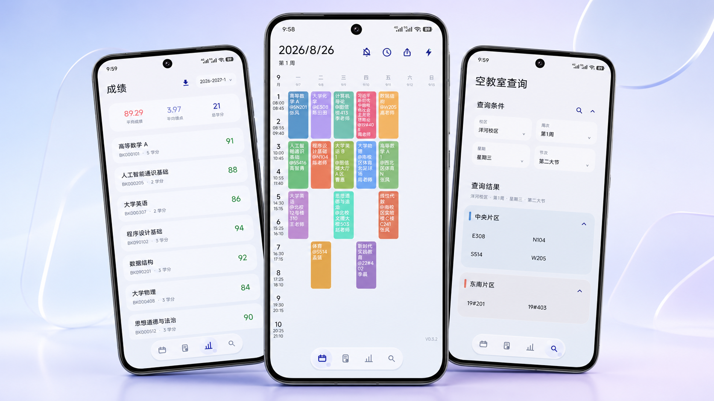
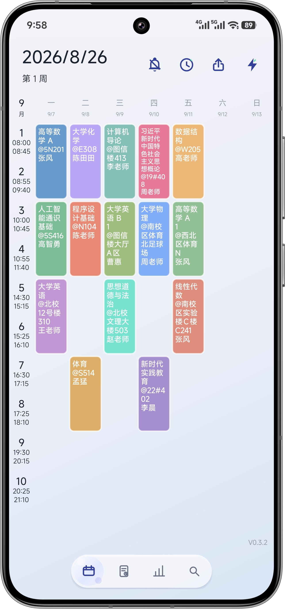
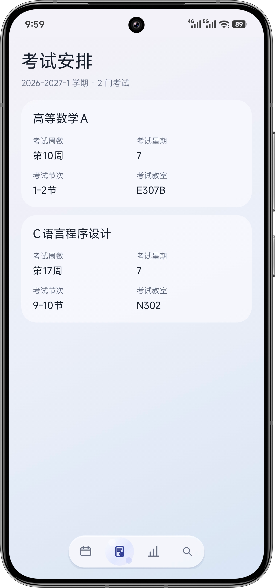
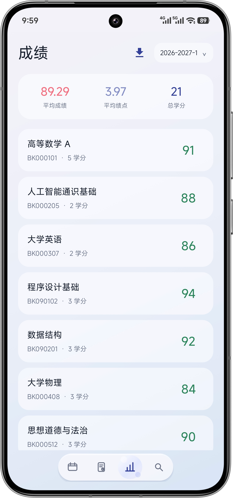
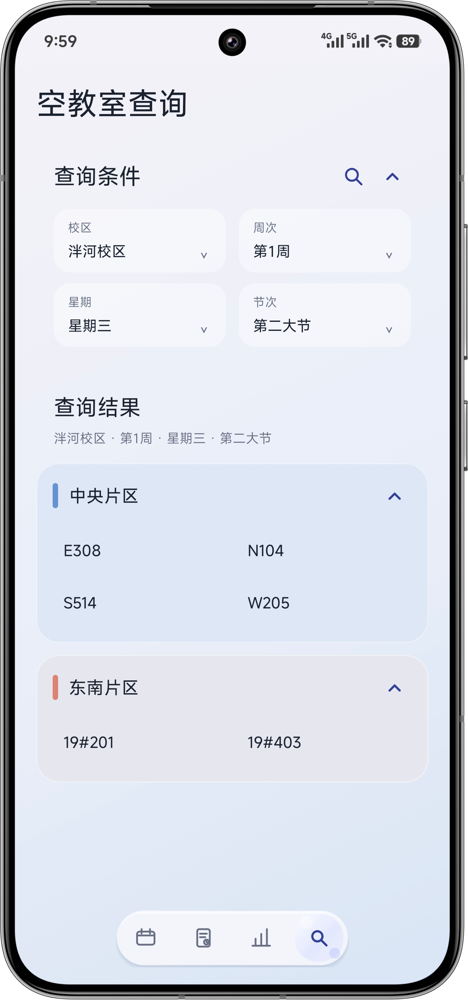
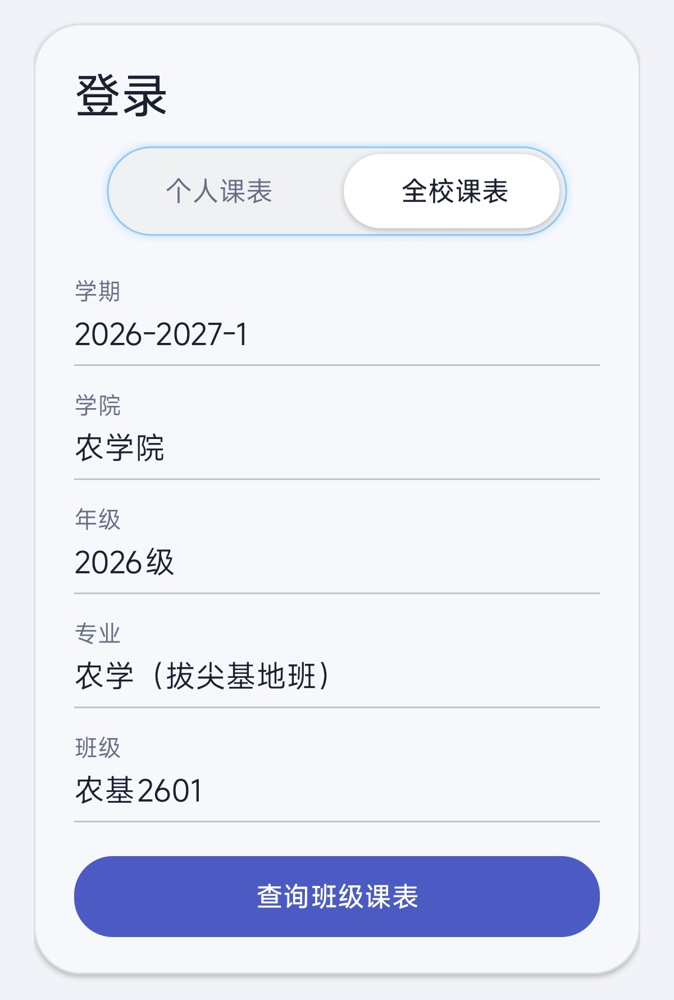

<div align="center">

# WeSDAU课程表

### 山东农业大学校园助手

课表、考试、成绩与空教室，一个app就足够。

`Android 8.0+`　 `个人课表`　 `全校课表`　 `课程提醒`　 `图片导出`

<br />



</div>

## 关于 WeSDAU

WeSDAU 是一款面向山东农业大学学生的 Android 校园工具。登录教务系统后，即可在简洁的界面中查看个人课表、考试安排和成绩，也可以查询任意班级课表与当前可用的空教室。

课表会保存在本地，网络暂时不可用时仍可查看；课程提醒、桌面组件和图片导出则让日常使用更方便。

## 核心功能

<table>
  <tr>
    <td width="33%" valign="top"><h3>📅 个人课表</h3>按周浏览课程，清晰展示课程名称、教室、教师、节次与上课周数。</td>
    <td width="33%" valign="top"><h3>🏫 全校课表</h3>按学院、年级、专业和班级逐级筛选，快速查询任意班级课表。</td>
    <td width="33%" valign="top"><h3>🔍 空教室查询</h3>选择校区、周次、星期和节次，按教学片区查看空闲教室。</td>
  </tr>
  <tr>
    <td width="33%" valign="top"><h3>📝 考试与成绩</h3>汇总考试时间和考场，查看成绩、学分、绩点及学期统计。</td>
    <td width="33%" valign="top"><h3>🔔 提醒与组件</h3>下一节课程自动提醒，桌面组件无需打开应用也能查看课程。</td>
    <td width="33%" valign="top"><h3>📤 导出与分享</h3>将课表、班级课表和成绩单保存为 PNG，也可分享课表 CSV。</td>
  </tr>
</table>

## 界面预览

<table>
  <tr>
    <td align="center"></td>
    <td align="center"></td>
    <td align="center"></td>
    <td align="center"></td>
  </tr>
  <tr>
    <td align="center"><strong>个人课表</strong></td>
    <td align="center"><strong>考试安排</strong></td>
    <td align="center"><strong>成绩查询</strong></td>
    <td align="center"><strong>空教室查询</strong></td>
  </tr>
</table>

## 查询任意班级课表

切换到“全校课表”，依次选择学期、学院、年级、专业和班级，即可查看对应班级的完整课表。查询结果也可以直接生成适合保存和分享的高清图片。

<table>
  <tr>
    <td align="center" width="28%"></td>
    <td align="center" width="72%"></td>
  </tr>
  <tr>
    <td align="center"><strong>选择班级</strong></td>
    <td align="center"><strong>导出完整周课表</strong></td>
  </tr>
</table>

## 成绩单导出

成绩页自动汇总平均成绩、平均学分绩点和总学分。点击导出即可生成包含课程代码、课程名称、学分、成绩和绩点的 PNG 成绩单。

<p align="center">
  
</p>

## 桌面组件

提供详细与紧凑两种组件布局，可根据桌面空间自由选择。

<p align="center">
  
  &nbsp;&nbsp;
  
</p>

## 还有这些细节

- 左右滑动切换周次，并支持快速返回当前周。
- 支持春秋与夏季作息时间。
- 可修改课程信息或添加自己的日程安排。
- 根据个人课表中的常用教学楼推荐空教室查询校区。
- 手机重启、应用升级或系统时间变化后自动恢复课程提醒。
- 全校课表云端更新后自动刷新本地数据。
- 支持应用内检查更新、下载并覆盖安装新版本。

## 开始使用

1. 安装应用，使用学校教务系统账号登录。
2. 等待首次数据同步完成。
3. 通过底部导航进入课表、考试、成绩或空教室页面。
4. 如需查看其他班级，在登录页切换到“全校课表”。

> 教务系统维护或网络异常时，在线查询可能暂时不可用；已经缓存的课表仍可离线查看。课程、考试、成绩和教室信息以学校教务系统数据为准。

## 版本信息

| 项目 | 当前值 |
| --- | --- |
| 版本 | `0.3.2`（Version Code 6） |
| 最低系统 | Android 8.0（API 26） |
| 开发语言 | Kotlin |

<details>
<summary><strong>本地构建</strong></summary>

项目使用 Android Gradle Plugin 构建，需要 JDK 17。

```bash
# Windows
./gradlew.bat assembleDebug

# macOS / Linux
./gradlew assembleDebug
```

</details>

<br />

<div align="center">

**让每天的课程安排更清楚一点。**

</div>
