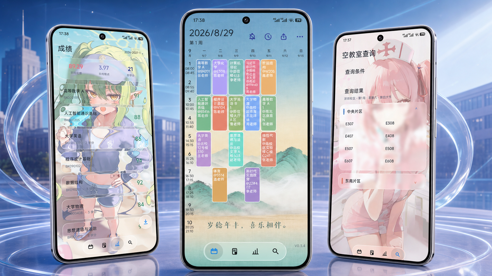
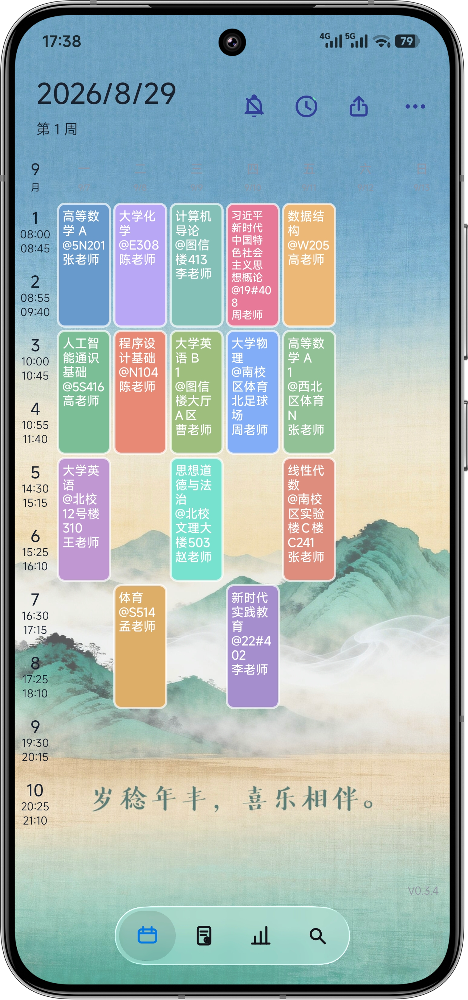
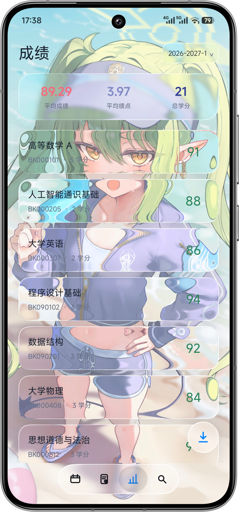
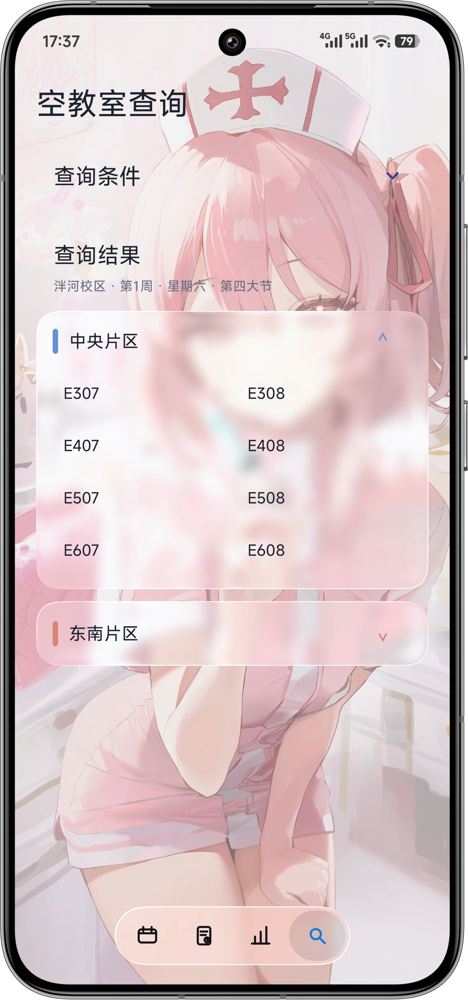
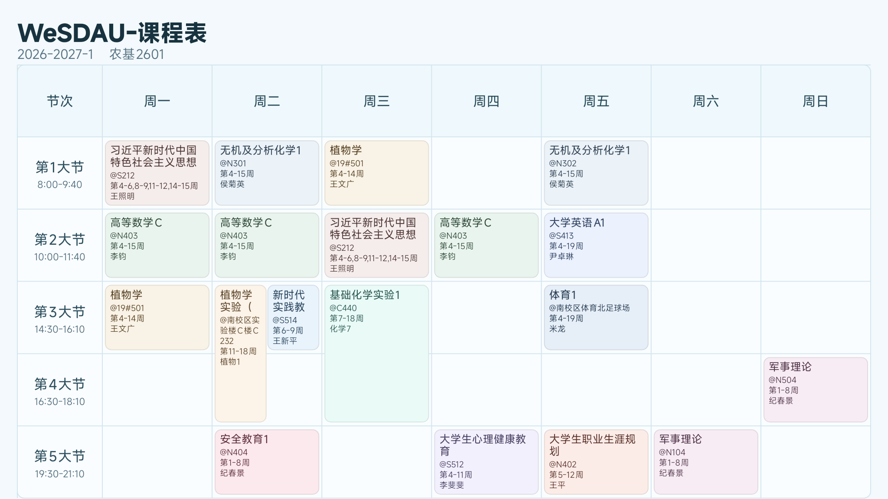
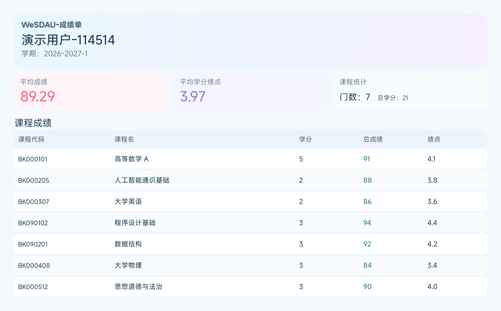
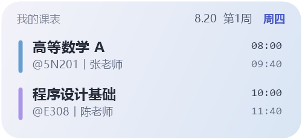
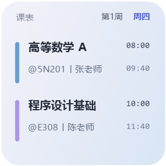

<div align="center">

# WeSDAU课程表

### 为山东农业大学学子打造的一站式校园助手

课表 · 考试 · 成绩 · 空教室 · 提醒 · 导出

`Android 8.0+`　 `Liquid Glass UI`　 `个人 / 全校课表`　 `离线可用`

<br />



<sub>画面中的应用界面均来自 WeSDAU V0.3.4 实机截图</sub>

</div>

## 关于 WeSDAU课程表

WeSDAU课程表 是一款面向山东农业大学学生的 Android 校园工具。登录教务系统后，可以集中查看个人课表、考试安排、成绩和空教室，也可以查询任意学院与班级的课表。

应用支持本地缓存、课程提醒、桌面组件、课表与成绩单导出，并提供可跟随自定义背景实时取色、模糊与折射的 LiquidGlass（液态玻璃） 界面。

## 核心功能

<table>
  <tr>
    <td width="33%" valign="top"><h3>📅 个人课表</h3>按周查看课程，展示课程名称、教师、教室、节次与上课周数，支持左右滑动切换周次。</td>
    <td width="33%" valign="top"><h3>🏫 全校课表</h3>按学院、年级、专业和班级逐级筛选，快速查看任意班级的完整课表。</td>
    <td width="33%" valign="top"><h3>🔍 空教室查询</h3>选择校区、周次、星期和节次，按教学片区查看当前可用教室。</td>
  </tr>
  <tr>
    <td width="33%" valign="top"><h3>📝 考试与成绩</h3>汇总考试时间、地点和课程信息，查看成绩、学分、绩点与学期统计。</td>
    <td width="33%" valign="top"><h3>🔔 提醒与组件</h3>在下一节课程开始前提醒，桌面组件无需打开应用即可查看近期课程。</td>
    <td width="33%" valign="top"><h3>📤 保存与分享</h3>将周课表、班级课表和成绩单保存为 PNG，也可分享 WakeUp 可导入的 CSV。</td>
  </tr>
</table>

## 新版界面

<p align="center">
  
  &nbsp;
  
  &nbsp;
  
</p>

<table>
  <tr>
    <td width="33%" align="center"><strong>个人课表</strong><br /><sub>清晰的周视图与底部导航</sub></td>
    <td width="33%" align="center"><strong>成绩查询</strong><br /><sub>课程成绩与学期统计</sub></td>
    <td width="33%" align="center"><strong>空教室查询</strong><br /><sub>按片区展示查询结果</sub></td>
  </tr>
</table>

## LiquidGlass 与个性化

- 底部导航、弹窗、按钮、成绩卡片、考试卡片和空教室结果均采用液态玻璃视觉。
- 玻璃组件会从当前页面和自定义背景中实时取色，并呈现模糊、折射与高光效果。
- 支持选择自己的背景图片，也可以一键恢复默认背景。
- 底部导航与登录页切换栏支持跟手滑动和动态选中效果。

## 课表体验

- 支持个人课表与全校课表左右滑动切换。
- 支持春秋作息和夏季作息，时间显示会随作息模式切换。
- 支持编辑课程信息和添加自己的日程。
- 法定节假日不会显示课程。
- 根据个人课表中的常用教学楼，自动推荐空教室查询校区。
- 云端全校课表发生变化时，通过 Hash 比对更新本地缓存。

## 提醒、离线与更新

- 课程数据会缓存在本地，短暂断网时仍可查看。
- 只安排下一次课程提醒，触发后自动续排，减少后台占用。
- 桌面组件降低联网频率，兼顾信息更新与续航。
- 支持应用内检查更新、下载完成后调用系统安装器覆盖安装。

## 导出与分享

<table>
  <tr>
    <td width="50%" align="center"></td>
    <td width="50%" align="center"></td>
  </tr>
  <tr>
    <td align="center"><strong>班级课表</strong></td>
    <td align="center"><strong>成绩单</strong></td>
  </tr>
</table>

## 桌面组件

提供详细与紧凑两种组件布局，可根据桌面空间自由选择。

<p align="center">
  
  &nbsp;&nbsp;
  
</p>

## 开始使用

1. 安装应用，并使用学校教务系统账号登录。
2. 等待首次课程数据同步完成。
3. 通过底部导航进入课表、考试、成绩或空教室页面。
4. 如需查看其他班级，在登录页切换到“全校课表”并选择班级。

> 教务系统维护或网络异常时，在线查询可能暂时不可用；已经缓存的课表仍可离线查看。课程、考试、成绩和教室信息以学校教务系统数据为准。

## 版本信息

| 项目 | 当前值 |
| --- | --- |
| 当前版本 | `0.3.4`（Version Code 8） |
| 最低系统 | Android 8.0（API 26） |
| 开发语言 | Kotlin |

<details>
<summary><strong>本地构建</strong></summary>

项目使用 Android Gradle Plugin 构建，需要 JDK 17。

```bash
# Windows
./gradlew.bat assembleRelease

# macOS / Linux
./gradlew assembleRelease
```

release APK 输出到：

```text
app/build/outputs/apk/release/CampusKit_V0.3.4.apk
```

</details>

<br />

<div align="center">

**让课表更清楚，让安排更从容。**

</div>
